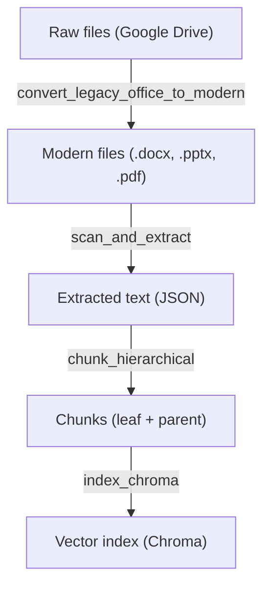

# Technical Documentation

## Overview

The application is a local Streamlit UI that queries a locally stored Chroma index. Documents are synchronized via Google Drive and then processed through an update pipeline (conversion, extraction, chunking, and indexing).

## Project structure

### General organization

The application is organized into specialized modules:

#### `src/ui/`

- `app.py` — Streamlit interface for the end user.
- Handles RAG queries, displays results and sources, and manages index updates.

#### `src/core/`

- `rag.py` — RAG logic (vector search, ranking, answer generation with citations).
- `update_pipeline.py` — Orchestrates the update pipeline by calling the successive steps.
- `registry.py` — Manages the document inventory (sources.csv) and related metadata.
- This is the core business logic of the application.

#### `src/pipeline/`

- Update pipeline steps called by `update_pipeline.py`:
  - `convert_legacy_office_to_modern.py` — Converts `.doc`/`.ppt` files to `.docx`/`.pptx`.
  - `scan_and_extract.py` — Scans files and extracts text (PDF, Word, PPT, etc.).
  - `chunk_hierarchical.py` — Splits documents into hierarchical chunks (leaf + parent).
  - `index_chroma.py` — Indexes chunks in Chroma with embeddings.

#### `src/admin/`

- Maintenance utilities:
  - `backup_index.py` — Exports/restores the Chroma index.
  - `reset_local_state.py` — Resets all local data.

#### `src/query/`

- `rag_answer.py` — RAG query tool for the CLI (alternative to the Streamlit UI).

#### `src/integrations/`

- External services and APIs:
  - `llm/openai_utils.py` — Wrapper for OpenAI calls (embeddings, generation).
  - `vector/chroma_utils.py` — Helpers for managing the Chroma index (create, load, delete).

#### `src/utils/`

- `paths.py` — Centralized file path constants.
- `logging_utils.py` — Log configuration.
- `fs_utils.py`, `common_utils.py`, `type_hints.py` — General helper modules.

### Update pipeline (data flow)

Main steps:

1. Legacy conversion (`.doc`, `.ppt` -> `.docx`, `.pptx`).
2. Scan and content extraction.
3. Hierarchical chunking (leaf + parent).
4. Chroma indexing.

### Runtime data

All outputs are isolated in `.runtime/` (git-ignored):

- `.runtime/registry/sources.csv` — Document inventory.
- `.runtime/data/extracted/` — Extracted text as JSON.
- `.runtime/data/chunks/leaf/` and `parent/` — Hierarchically split chunks.
- `.runtime/data/index/chroma/` — Persistent vector index.
- `.runtime/logs/` — Detailed execution logs.
- `.runtime/backups/` — Index backups.

## Configuration

The `.env` file at the project root contains:

- `OPENAI_API_KEY`: OpenAI API key.
- `RAW_DIR`: Local path to the synchronized Google Drive folder.
- Optional: `SOFFICE_PATH`: Path to `soffice.exe` (unnecessary in Docker container).
- Optional: `CONVERTED_DIR` to change the conversion output folder.

## RAG

Default parameters are defined in `src/core/rag.py`.

Models:

- Embeddings: `text-embedding-3-small`
- Generation: `gpt-5-mini`

## Launch and shortcuts

- `scripts/setup.ps1` / `.sh`: initializes the `.env` file and builds the Docker image.
- `scripts/create_shortcut.ps1`: creates an "Assistant documentaire" shortcut in the Windows Start menu.
- `scripts/launch_app.sh`: launches the app on macOS.
- `scripts/launch_app.ps1`: orchestrates Docker and opens the browser on Windows.
- `scripts/launch_app.vbs`: launches the app on Windows (avoids opening a terminal window).

## Software update

Simple update strategy:

- Replace the project files with the new version.
- Rerun `make docker-install` (or the setup script) to rebuild the Docker image if dependencies changed.
- Recreate the shortcut if the project folder has changed.

## Logs

Logs are stored in `.runtime/logs/`:

- `rag_answer.log`: queries and generation.
- `update_pipeline.log`: update pipeline execution.
- `scan_and_extract.log`, `chunk_hierarchical.log`, `index_chroma.log`, `convert_legacy_office_to_modern.log`.

## Backup / restore the index

Run:
`python -m src.admin.backup_index`

Export:
`python -m src.admin.backup_index export`
Optional: add `--zip` to create an archive.

Restore:
`python -m src.admin.backup_index restore --input <path> --yes`

## Local reset (advanced)

Destructive script that deletes local data:
`python -m src.admin.reset_local_state --yes`

Use only if:

- The index is corrupted.
- You want to start from a clean local state.

## Troubleshooting

- LibreOffice error: set `SOFFICE_PATH` in `.env`.
- Indexing error: check the OpenAI API key and connectivity.
- No sources found: verify the scan and chunking steps.
